# 🚀 Pas 1 · Preparar l'entorn de treball

> [!NOTE]
> Aquest és el primer pas del **Sprint 0 · Preparació** del **Projecte 1 · Infraestructura Web**.
>
> L'objectiu és preparar el teu entorn de treball perquè durant la resta del curs pugues desplegar i administrar aplicacions web sobre AWS.

---

# 🎯 Objectius

En finalitzar aquest pas seràs capaç de:

- Accedir a AWS Academy.
- Llançar el teu **Learner Lab**.
- Comprendre el funcionament del laboratori.
- Instal·lar **AWS CLI**.
- Configurar les credencials del laboratori.
- Verificar que la configuració és correcta.

---

# 1. Accedir a AWS Academy

Rebràs un correu electrònic amb una invitació a **AWS Academy**.

Prem **Comenzar** i accepta la invitació.

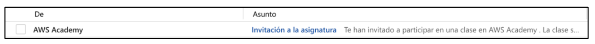

Si és la primera vegada que accedeixes, crea el teu compte de Canvas.

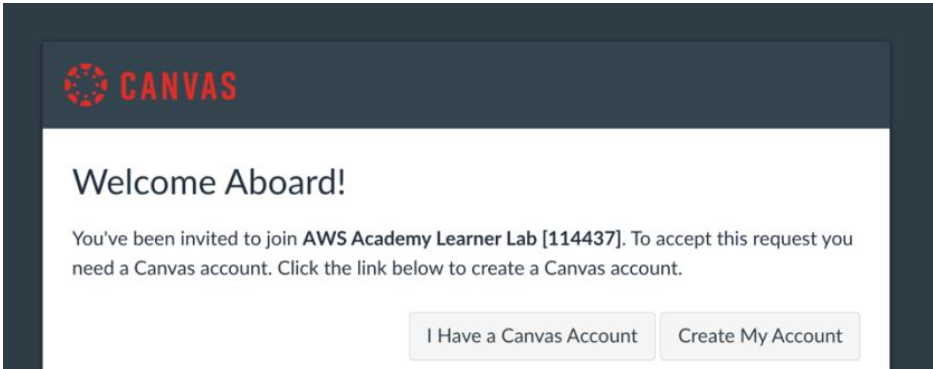

---

# 2. Accedir al curs

Quan inicies sessió arribaràs al panell principal.

Selecciona el curs d'AWS Academy.

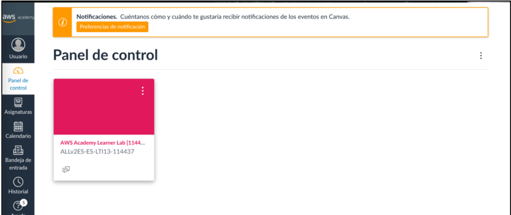

Després accedeix al **Learner Lab**.

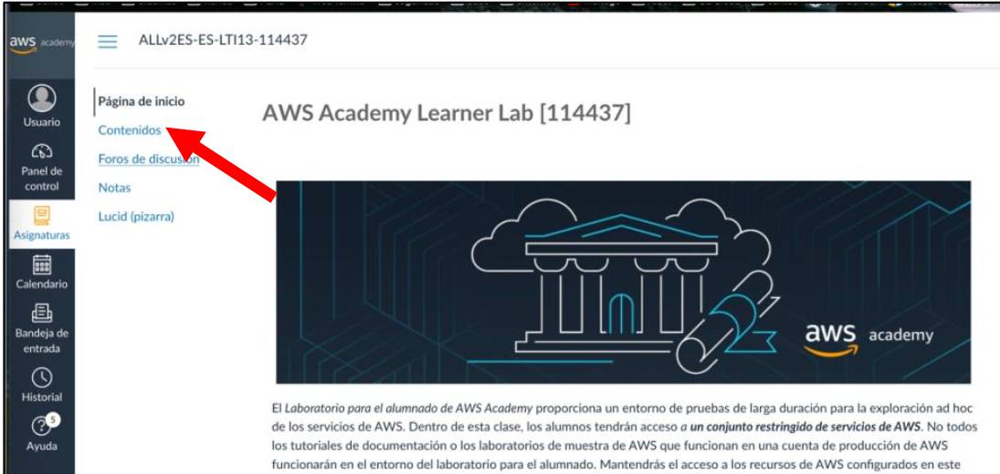

---

# 3. Llançar el laboratori

Dins del curs trobaràs l'opció:

**Launch Lab**

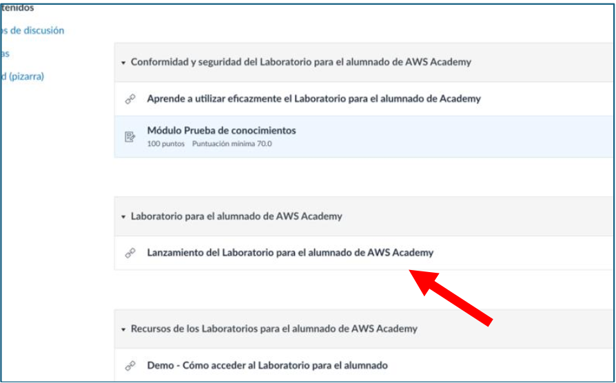

La primera vegada hauràs d'acceptar les condicions d'ús.

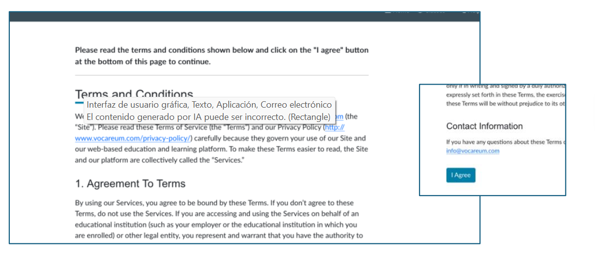

Ara prem:

**Start Lab**

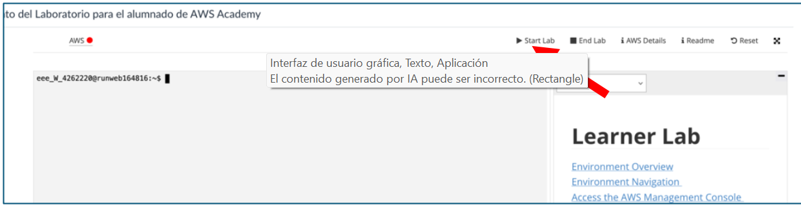

> [!IMPORTANT]
> El laboratori necessita uns minuts per preparar-se.
>
> Espera fins que aparega l'indicador en color verd.

---

# 4. Accedir a la consola AWS

Quan el laboratori estiga preparat podràs accedir a la consola d'AWS.

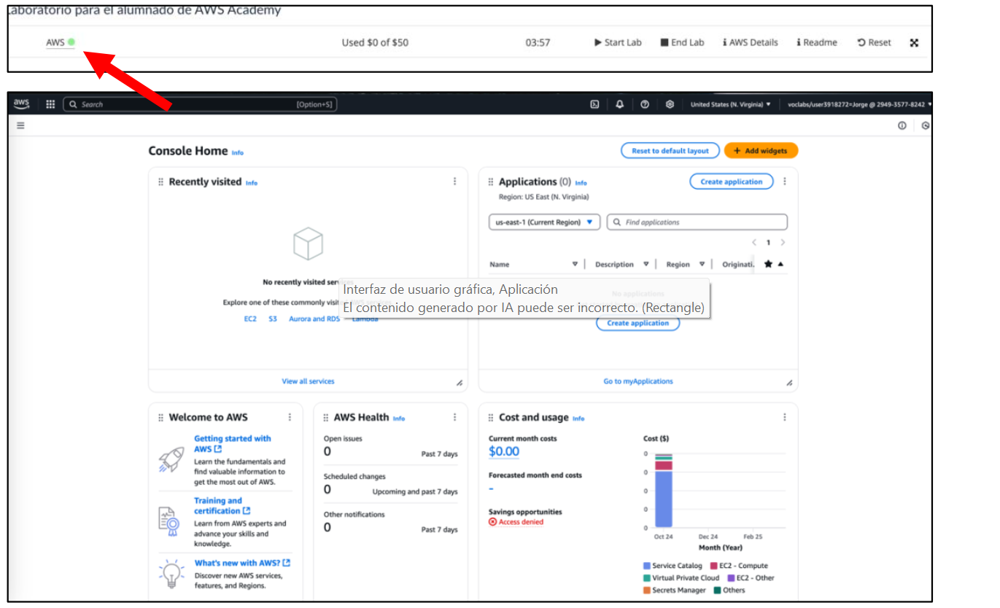

A partir d'ara totes les pràctiques del mòdul es desenvoluparan sobre aquesta infraestructura.

> [!WARNING]
> El laboratori disposa d'un pressupost limitat.
>
> No deixes recursos en funcionament quan acabes una pràctica.

---

# 5. Instal·lar AWS CLI

Per administrar AWS també utilitzarem el terminal.

Instal·la **AWS CLI** des de la documentació oficial:

https://docs.aws.amazon.com/es_es/cli/latest/userguide/getting-started-install.html

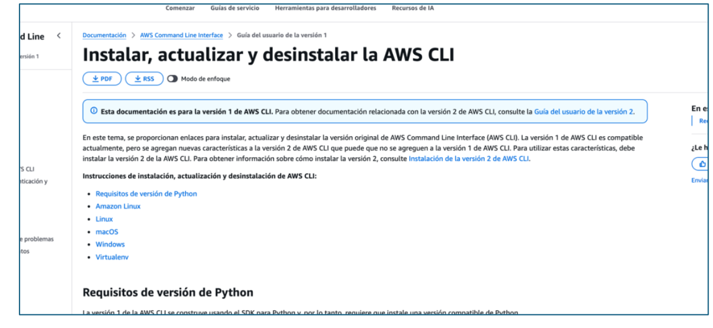

Quan finalitze la instal·lació comprova que funciona.

```bash
aws --version
```

Hauries d'obtenir una resposta semblant a aquesta.

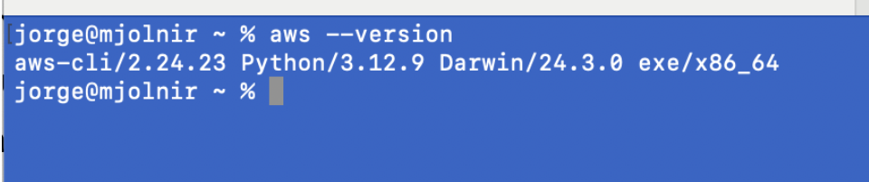

---

# 6. Obtenir les credencials del laboratori

Torna al Learner Lab.

Prem:

**AWS Details**

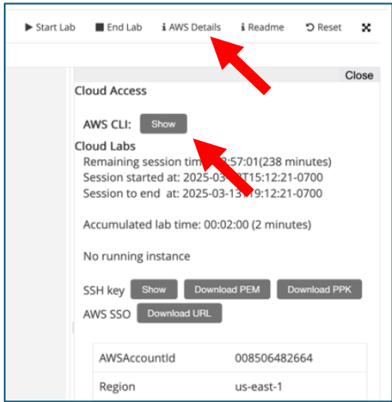

Després prem:

**Show**

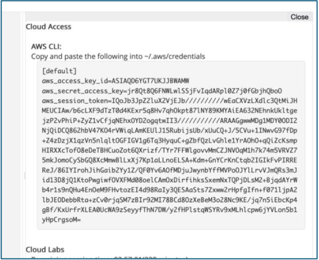

---

# 7. Configurar AWS CLI

Executa:

```bash
aws configure
```

Introdueix les dades proporcionades pel laboratori.

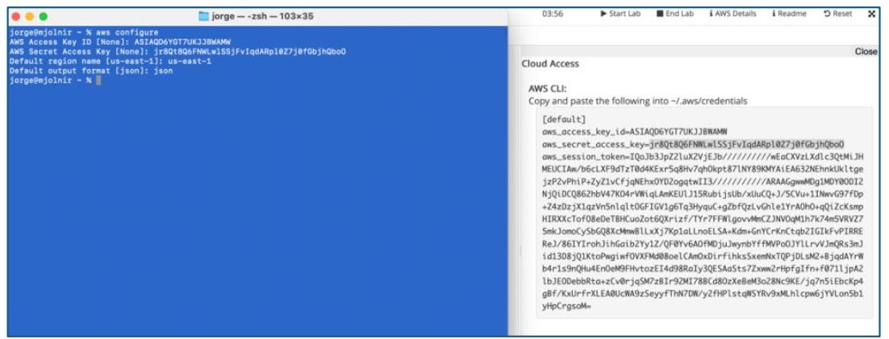

---

# 8. Comprovar la configuració

Executa:

```bash
aws sts get-caller-identity
```

Si apareix un error relacionat amb el **Session Token**, caldrà actualitzar el fitxer de credencials.

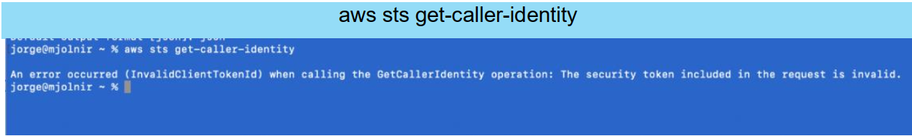

Obri:

```text
~/.aws/credentials
```

i copia el contingut complet proporcionat per **AWS Details**.

Si és necessari, substitueix tot el fitxer.

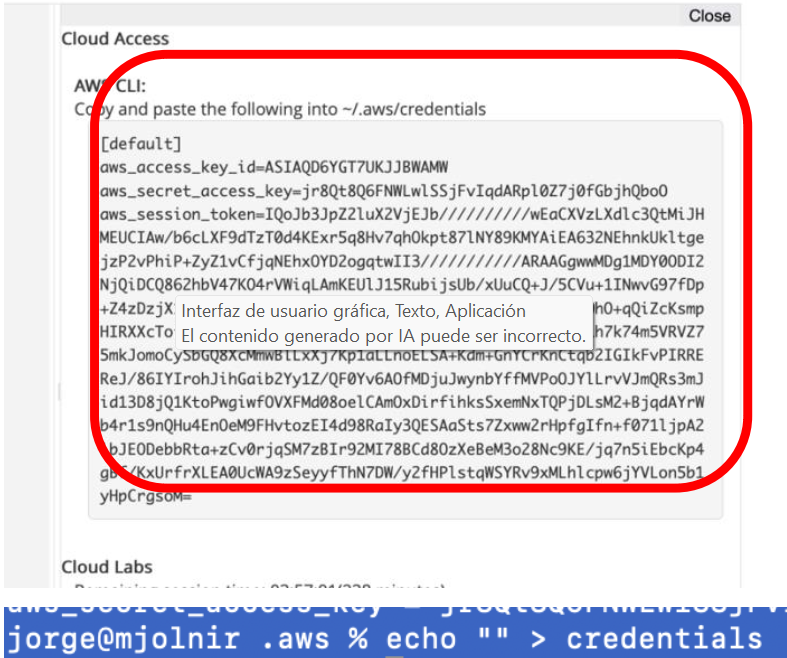

Torna a executar:

```bash
aws sts get-caller-identity
```

Si tot és correcte, AWS retornarà la informació del teu usuari.

---

# ✅ Checklist

Abans de continuar comprova que:

- [ ] He accedit a AWS Academy.
- [ ] He iniciat el Learner Lab.
- [ ] Puc accedir a la consola AWS.
- [ ] He instal·lat AWS CLI.
- [ ] `aws --version` funciona.
- [ ] He configurat AWS CLI.
- [ ] `aws sts get-caller-identity` funciona correctament.

---

# 📸 Evidències

Inclou al README del Sprint:

- Captura de la consola AWS.
- Resultat de `aws --version`.
- Resultat de `aws sts get-caller-identity`.

> [!CAUTION]
> No compartisques mai públicament les teues claus d'accés ni el **Session Token**.

---

## ➡️ Següent pas

Quan tingues l'entorn preparat, continua amb **Pas 2 · Primera connexió a una instància EC2**.