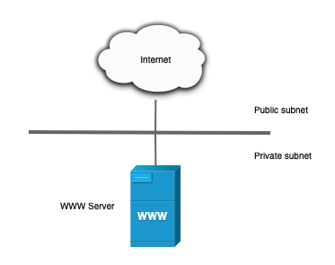

Implantación de Aplicaciones Web

Curso 2026/2027

## Instalación de la pila LAMP en una instancia EC2 de AWS con Ubuntu Server

En esta práctica tendremos que crear una instancia EC2 en [Amazon Web Services (AWS)](https://aws.amazon.com/es/) con la última versión de [Ubuntu Server](https://www.ubuntu.com/server), e instalar todos los paquetes necesarios para tener una [pila LAMP](https://es.wikipedia.org/wiki/LAMP) y todas las herramientas adicionales que hemos estudiado en el apartado de teoría de esta práctica.

Deberá automatizar el proceso de instalación y configuración de la pila LAMP, haciendo uso de todos los **scripts de Bash** que sean necesarios para llevarlo a cabo.

## Arquitectura web con un único servidor

En esta práctica vamos a trabajar con una arquitectura web basada en un único servidor.



**Ventajas:**

-   Es una solución sencilla de implementar ya que sólo tenemos un único servidor.
-   Puede ser útil para aplicaciones que van a tener poca carga de trabajo.

**Inconvenientes:**

-   Esta solución puede provocar problemas de rendimiento ante una carga de trabajo elevada, ya que todos los servicios se están ejecutando sobre la misma máquina y tienen que competir por los mismos recursos.
-   Al estar todos los servicios ejecutándose sobre la misma máquina, no va a ser posible escalar nuestro sistema horizontalmente, es decir, añadiendo más nodos al sistema para repartir la carga. En este caso habrá que escalar verticalmente, añadiendo más recursos sobre la máquina donde están todos los servicios.

## Tareas a realizar

Tendremos que realizar la instalación de la pila LAMP para el sistema operativo [Ubuntu Server](https://www.ubuntu.com/server), que se estará ejecutando en una instancia de EC2 de [Amazon Web Services (AWS)](https://www.mysql.com/).

A continuación se describen **muy brevemente** algunas de las tareas que tendrá que realizar.

1.  Crea una máquina instancia EC2 en AWS.
    
2.  La **Amazon Machine Image (AMI)** que vamos a seleccionar para esta práctica será una **Community AMI** con la última versión de **Ubuntu Server**.
    
3.  Cuando esté creando la instancia deberá configurar los puertos que estarán abiertos para poder conectarnos por SSH y para poder acceder por HTTP/HTTPS.
    
    -   SSH (TCP)
    -   HTTP (TCP)
    -   HTTPS (TCP)
4.  Crea un par de claves (pública y privada) para conectar por SSH con la instancia. También puedes hacer uso de las claves que te proporciona AWS Academy (_vockey.pem_).
    
5.  Crea una dirección **IP elástica** y asígnala a la instancia EC2.
    
6.  Realice la instalación automática de la pila LAMP y todas las herramientas adicionales propuestas en la instancia EC2.
    
7.  Busque cuál es la dirección IP elástica de su instancia y compruebe que puede acceder a ella desde una navegador web.
    

## Entregables

Deberá crear un repositorio en [GitHub](https://github.com/) con el nombre de la práctica y añadir al profesor como colaborador.

El repositorio debe tener el siguiente contenido:

-   Un **documento técnico** con la descripción de todos los pasos que se han llevado a cabo.
-   Los **scripts de Bash** que se han utilizado para automatizar la instalación y configuración de la pila LAMP, así como de las herramientas adicionales.

Además del contenido anterior puede ser necesario crear otros archivos de configuración. A continuación se muestra un ejemplo de cómo puede ser la estructura del repositorio:

```
.
├── README.md
├── conf
│&nbsp;&nbsp; └── 000-default.conf
├── htaccess
│&nbsp;&nbsp; └── htaccess
├── php
│&nbsp;&nbsp; └── info.php
└── scripts
    ├── .env
    ├── install_lamp.sh
    └── install_tools.sh
```

### Documento técnico

El documento técnico `README.md` tiene que estar escrito en [Markdown](https://es.wikipedia.org/wiki/Markdown) y debe incluir **como mínimo** los siguientes contenidos:

-   Descripción de la instalación de [Apache HTTP Server](https://httpd.apache.org/), [PHP](http://www.php.net/), [MySQL Server](https://www.mysql.com/) en la última versión [Ubuntu Server](https://www.ubuntu.com/server).
    
-   Descripción de la instalación de [phpMyAdmin](https://www.phpmyadmin.net/).
    
-   Descripción de la instalación de [Adminer](https://www.adminer.org/).
    
-   Instalación del analizador de logs [GoAccess](https://goaccess.io/) para Apache Server.
    
-   [Control de acceso a un directorio con `.htaccess`](https://httpd.apache.org/docs/trunk/es/howto/htaccess.html).
    
-   Cada descripción debe ir acompañada de **alguna/s captura/s de pantalla**, donde se pueda ver claramente los pasos que se han llevado a cabo.
    

### Scripts de Bash

El directorio `scripts` debe incluir los siguientes archivos:

-   `.env`: Este archivo contiene todas las variables de configuración que se utilizarán en los scripts de Bash.
    
-   `install_lamp.sh`: Script de Bash con la automatización del proceso de instalación de la pila LAMP.
    
-   `install_tools.sh`: Script de Bash con la automatización del proceso de instalación de las herramientas adicionales.
    

### Actividad de ampliación

Como **actividad de ampliación** se propone:

-   Instalación del analizador de logs [AWStats](https://awstats.sourceforge.io/) para Apache Server.

## Anexo. ¿Cómo gestionar los archivos `.env`?

Los archivos `.env` son archivos de texto que se suelen utilizar para almacenar variables de entorno con información sensible, com contraseñas, claves de API, etc.

Estos archivos no se deberían subir a un repositorio público, porque cualquier persona podría acceder a ellos y obtener las contraseñas que contienen.

**Paso 1**. Crear un archivo `.gitignore` en el repositorio.

Para evitar que estos archivos se guarden en el repositorio poemos crear un archivo `.gitignore` en la raíz de nuestro repositorio y añadir el nombre del archivo que no queremos tener bajo el control de versiones, que en este caso es el archivo `.env`.

```
.env
```

**Paso 2.** Crear un archivo `.env.example` y añadirlo al repositorio.

Podemos crear un archivo `.env.example` y añadirlo al repositorio. Este archivo almacenará todas las variables que se tienen que configurar en el archivo `.env`, pero estarán sin inicializar.

Ejemplo:

```
PHPMYADMIN_APP_PASSWORD=
APP_USER=
APP_PASSWORD=
STATS_USERNAME=
STATS_PASSWORD=
```

De esta forma, cuando alquien quiera desplegar el proyecto que contiene el repositorio, sólo tendrá que copiar el archivo `.env.example`, renombrarlo a `.env` y actualizar las variables de entorno con los valores correctos.

Para gestionar estas variables en un entorno de producción existen varias soluciones:

-   Se pueden crear directamente en el servidor.
-   Sí se utiliza una plataforma de despliegue como [Vercel](https://vercel.com/), [Netlify](https://www.netlify.com/) o [Heroku](https://www.heroku.com/), se pueden configurar en la interfaz de usuario web de la plataforma.
-   Se pueden utilizar servicios para almcenar secretos como [AWS Secrets Manager](https://aws.amazon.com/es/secrets-manager/) o [HashiCorp Vault](https://developer.hashicorp.com/vault).

## Referencias

-   [Amazon Web Services (AWS)](https://aws.amazon.com/es/)
-   [Ubuntu Server](https://www.ubuntu.com/server)
-   [LAMP Stack](https://es.wikipedia.org/wiki/LAMP)
-   [PHP](http://www.php.net/)
-   [Apache HTTP Server](https://httpd.apache.org/)
-   [MySQL Server](https://www.mysql.com/)
-   [Configuraciones comunes para aplicaciones web](https://www.digitalocean.com/community/tutorials/5-configuraciones-comunes-para-tus-aplicaciones-web-es)
-   [Markdown](https://es.wikipedia.org/wiki/Markdown)
-   [PHPMyAdmin](https://www.phpmyadmin.net/)
-   [Adminer](https://www.adminer.org/)
-   [GoAccess](https://goaccess.io/)
-   [AWStats](https://awstats.sourceforge.io/)
-   [Tutorial del Servidor Apache HTTP: Ficheros `.htaccess`](https://httpd.apache.org/docs/trunk/es/howto/htaccess.html)

## Licencia

[![Licencia de Creative Commons](data:image/png;base64,iVBORw0KGgoAAAANSUhEUgAAAFgAAAAfCAMAAABUFvrSAAAAAXNSR0IB2cksfwAAAARnQU1BAACxjnz7UZMAAAAgY0hSTQAAeiUAAICDAAD5/wAAgOkAAHUwAADqYAAAOpgAABdvkl/FRgAAAf5QTFRFAAAAAAAA////////////8fHx7+/v6Ofn4+Pj4N/g39/f1tXV09bS0tXS0tXR0dTR0dTQ0NTQ0NPPz9PPztLOztHNzdHNzdHMz8/PzdDMzNDMzNDLzM/Ly8/Ly8/Ky87Kys3Jyc3Jyc3Iy8rLyMzIyMzHx8vHxsrGycjIxsrFxcnFyMfHxcnExMnExMjDw8jDxMfDw8fCwsfCwcXAwMXAwMW/wMS/v8S+v8O+vsO+vsK9vcK9vcK8v7+/vMG8vMG7vMC8u8C7u8C6ur+6ur+5ub65ub64uL23t7y2urm5tru1tbq0tLqztLmzs7iysrixtbW1srexsbewsLavsLWvr7Wur7SusLOvrrStrrOtr7KvrbOsrLKrr6+vq7GqrKurpqqmo6ijoqaho6Ghn6OenqCdn5+fnp2dn5aampiZlpmWlZmUmJaXk5iTkZSRkZORkY+Pj4+PiYyJjIqLjoeLh4aHhIaEhIWEgoWChIGCf4F+gICAfX98fH98fnt8en15eXx5eHV2dnN0dXJzcHJvcHBwbmxsaGVmY19hYGBgXV5dWldYUFFQUFBQQ0RDQEBAPj8+Pzs8Pzc5NTY1MjMxMjExMDAwMS0uLS0tKioqKSopKSkpKCkoKCgoKicnKCUmJCQkIx8gICAgHxscGxsbGRkZEBAQDg4ODQ4NDQwNNUYWmgAAAAR0Uk5T/wAKDnDBpeYAAAPASURBVHjatZaNf1JVHMaf6kAEbF6vsgyQ6ygsmjKJptNG2NoY23Lm1mq2DSp1682xrLSF1qKocAO0F1ZCL4cm4n/Zb4fdl27zM8XPHuBzPvfLPQ+H53fP7148hh3RIwBGE/HY8Uh3MNCpeN1ur+9AIBiK9MYGE6Nj429MTU/PJB9cEL4DfUfDQb/PJUttTmfbLtm13x8M9/QNbDhPTk3PtOhMvi+GDiou6UqxAVKjeFna6wscjrxEzqcnJs9OzyxXQKos6/O2JQDi5BvwyOl1aFpfkN3+Q5G+wcSpMxNTH1WBUi5XAqoXk0IXtycAYkdDAbe0CqCez0SjmXwdwOqRJ/2He2LxkbHx9+6gYGckewF3xKzz90EAHA8f9JAv6hkra2qOrKtH3IFwb//Q6JkK8sSAjS9QTZKqgiyumIitq8umEQCRoCKTb9nONFnLwKrsC0b64iNXUXCoxqyAZUoTv35AvrfvZm0aoXPOcdKwIE3j7mdcafIVyzU6L+z1h471J27BrnM7KslkBX/xmz8g8zlSGrGzLv7Tj1nOFwURxkGftI76PvYfWetYl/YHIy/HUWKkPJBnpBJoTunbbzjnWZtDJ8zyPv+MsXm+JogwDnRcATLMpDngsisQPjGAHCOBxEg50BwiXVkAWYdOLH/zPyhmzh8n0jTu3FNEnYKIFkqlTHP4hCbUUZQPUBZbG5NHdo3zlWGNvP5bVBg/oRkrUgN5MgRIpVkx0HEejV2+Qz2v/D8KQSzzzMFJN1UyfO45xlKc61F42wFaYhk1e7Q2V0bZPlubE1m0eYOR2O/N4gGG4hFZ4WtryKa++kcl85wvLf3JP9aL53ECUcZEztog/oHT/Wwk9iUKzHy5EbEt3b67aDGSJU763iLI/RgP3dI3SM64QT5dMZGnUylHk5ijsO6rZSiKjUGPYuidlra0XrzNqmnFy6EhKVS8odferQDlfK6st5zz1W2JuNxWUWfa5TZbEgOroSh3ho69mjg1/ubXLbXNQEeasth6g7xwYnBkbIJ6fSuN/nmxpe332tKjp1s1piZ0YasmlHb5u3v7qdVPnp1pyRjXFPk6ORvakF20TeULPKS+8+42Nnprpg78LHmu4aF11b37uunWJD31IVQ19wfER0g9IG46iZmdvfIF4800LXt0X7DNN9NJ89j0UwKY01BcUlq9/S9ILsWYg9o2DWTzZZDaTmDSL2/7OvZI7U5nu0QPLG/dgEF6EEbCzAtUgVk3Lp1UvB6PVzl5iWyxzYpVc3MdGHZcj+7Q0+a/KrvgUC2hl58AAAAASUVORK5CYII=)](http://creativecommons.org/licenses/by-nc-sa/4.0/)  
