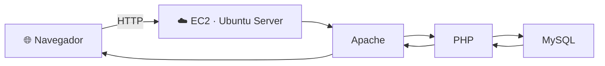

# Sprint 4 · Despliegue de una aplicación web LAMP sencilla

**Implantación de Aplicaciones Web · 2.º ASIX**  
**Curso 2026/2027 · PorçonsTech**

---

## Índice

- [1. Despliegue de una aplicación web LAMP sencilla](#1-despliegue-de-una-aplicación-web-lamp-sencilla)
  - [1.1. Punto de partida](#11-punto-de-partida)
  - [1.2. Repositorio de la aplicación](#12-repositorio-de-la-aplicación)
  - [1.3. Arquitectura](#13-arquitectura)
  - [1.4. Tareas a realizar](#14-tareas-a-realizar)
  - [1.5. Comprobaciones finales](#15-comprobaciones-finales)
  - [1.6. Entrega en GitHub](#16-entrega-en-github)
    - [1.6.1. Evidencias](#161-evidencias)
    - [1.6.2. Ficheros técnicos](#162-ficheros-técnicos)
    - [1.6.3. Qué no debes subir](#163-qué-no-debes-subir)
- [2. Preguntas de comprensión](#2-preguntas-de-comprensión)
- [3. Referencias](#3-referencias)
- [4. Checklist final](#4-checklist-final)

---

# 1. Despliegue de una aplicación web LAMP sencilla

En este Sprint vamos a desplegar una aplicación web PHP que utiliza una base de datos MySQL sobre la infraestructura que ya hemos preparado en los Sprints anteriores.

> **Objetivo:** no se trata de repetir toda la instalación del servidor, sino de aprender a desplegar una aplicación real, conectarla con MySQL y comprobar que funciona correctamente.

Al finalizar, tendremos una aplicación accesible desde el navegador y capaz de consultar y modificar información almacenada en la base de datos.

---

## 1.1. Punto de partida

Antes de empezar, comprueba que tu instancia EC2 sigue disponible y que puedes conectarte por SSH.

También debes tener operativos los componentes de la pila LAMP:

- **Linux** → Ubuntu Server.
- **Apache** → servidor web.
- **MySQL** → sistema gestor de bases de datos.
- **PHP** → lenguaje que se ejecutará en el servidor.

No es necesario crear una nueva instancia EC2 ni volver a documentar toda la instalación de LAMP.

### Comprobación inicial

Antes de desplegar la aplicación, verifica que los servicios necesarios están funcionando.

Por ejemplo:

```bash
sudo systemctl status apache2
sudo systemctl status mysql
php --version
```

Si alguno de estos elementos no funciona, resuelve primero la incidencia antes de continuar.

---

## 1.2. Repositorio de la aplicación

La aplicación que vamos a desplegar se encuentra en:

**Repositorio:**  
[anamollabas/iaw-practica-lamp](https://github.com/anamollabas/iaw-practica-lamp)

Puedes obtener una copia en el servidor utilizando Git:

```bash
git clone https://github.com/anamollabas/iaw-practica-lamp.git
```

> Antes de copiar ficheros o modificar configuraciones, revisa la estructura del repositorio e identifica qué necesita la aplicación para funcionar.

---

## 1.3. Arquitectura

En este Sprint seguimos utilizando una arquitectura sencilla de **un único servidor**:



Todos los componentes se ejecutan en la misma instancia EC2.

Por eso, en este Sprint la aplicación podrá conectarse a MySQL utilizando normalmente:

```text
DB_HOST = localhost
```

### ¿Qué ocurre cuando accedemos a la aplicación?

```text
Navegador
    ↓
Apache recibe la petición
    ↓
PHP ejecuta el código de la aplicación
    ↓
PHP consulta o modifica datos en MySQL
    ↓
Apache devuelve la respuesta al navegador
```

---

## 1.4. Tareas a realizar

### 1. Comprobar la infraestructura

Verifica que:

- la instancia EC2 está en ejecución;
- puedes acceder por SSH;
- Apache está activo;
- PHP está instalado;
- MySQL está activo;
- el puerto HTTP necesario está permitido en el Security Group.

---

### 2. Obtener el código de la aplicación

Clona o descarga el repositorio:

```bash
git clone https://github.com/anamollabas/iaw-practica-lamp.git
```

Examina los ficheros antes de desplegarlos.

Identifica, al menos:

- los ficheros PHP;
- el fichero de configuración de la conexión;
- los ficheros SQL, si existen;
- cualquier directorio que deba ser publicado por Apache.

---

### 3. Desplegar la aplicación en Apache

Sitúa la aplicación en el directorio que Apache está utilizando para servir el contenido web.

Por ejemplo:

```text
/var/www/html/
```

Comprueba después que Apache puede acceder a los ficheros y que los permisos son adecuados.

> No cambies permisos de forma indiscriminada. Debes poder explicar qué usuario necesita acceder a cada recurso y por qué.

---

### 4. Preparar MySQL

Crea la base de datos necesaria para la aplicación.

Cuando sea posible, utiliza un **usuario específico para la aplicación** en lugar de conectar la aplicación como `root`.

La aplicación necesitará conocer, como mínimo:

```text
DB_HOST
DB_NAME
DB_USER
DB_PASSWORD
```

Si el repositorio incluye un fichero `.sql`, impórtalo para crear la estructura necesaria.

---

### 5. Configurar la conexión PHP → MySQL

Localiza el fichero donde la aplicación configura la conexión con la base de datos.

Comprueba que coinciden:

- nombre de la base de datos;
- usuario;
- contraseña;
- host del servidor MySQL.

En este Sprint, al estar PHP y MySQL en la misma EC2, normalmente utilizaremos:

```text
localhost
```

> **Importante:** no publiques la contraseña real de MySQL en GitHub.

---

### 6. Probar la aplicación

Accede desde el navegador utilizando la IP pública de tu EC2:

```text
http://IP_PUBLICA/
```

Comprueba que:

- la página se carga;
- PHP se ejecuta;
- la aplicación conecta con MySQL;
- las funcionalidades que utilizan datos responden correctamente.

---

### 7. Realizar una prueba CRUD

Realiza, según permita la aplicación, alguna operación de:

- **Create** → crear;
- **Read** → consultar;
- **Update** → modificar;
- **Delete** → eliminar.

Después vuelve a consultar los datos y comprueba que el cambio se ha guardado realmente en MySQL.

---

## 1.5. Comprobaciones finales

Antes de dar el Sprint por terminado, debes poder responder **sí** a todas estas preguntas:

| Comprobación | Resultado |
|---|:---:|
| ¿Apache está activo? | ☐ |
| ¿PHP se procesa correctamente? | ☐ |
| ¿MySQL está activo? | ☐ |
| ¿La aplicación es accesible desde el navegador? | ☐ |
| ¿La aplicación conecta con MySQL? | ☐ |
| ¿Una operación CRUD modifica realmente los datos? | ☐ |
| ¿No has publicado ninguna contraseña o credencial? | ☐ |

---

## 1.6. Entrega en GitHub

No tienes que crear un repositorio nuevo para esta práctica.

Utiliza el **repositorio del Projecte 1** y crea la carpeta correspondiente a este Sprint:

```text
IAW-P1-cognom-nom/
└── sprint03/
    ├── README.md
    ├── imatges/
    ├── conf/
    └── sql/
```

El fichero `README.md` será tu documentación del Sprint.

> **No queremos un tutorial repetido paso a paso.** Queremos evidencias seleccionadas que demuestren que el despliegue funciona y pequeñas explicaciones que demuestren que entiendes el proceso.

---

### 1.6.1. Evidencias

Incluye las siguientes evidencias.

#### E1 · Aplicación publicada

Captura del navegador mostrando la aplicación funcionando.

```markdown

```

**Explica en 2-4 líneas:**  
¿Qué camino sigue una petición desde el navegador hasta que recibes la respuesta?

---

#### E2 · Base de datos preparada

Captura de MySQL donde se vea:

- la base de datos utilizada;
- las tablas principales.

```markdown

```

**Explica en 2-4 líneas:**  
¿Por qué necesita la aplicación esta estructura de base de datos?

---

#### E3 · Configuración de la conexión

No hagas una captura donde aparezca la contraseña.

Completa esta tabla en tu `README.md`:

| Parámetro | Valor o función |
|---|---|
| `DB_HOST` | |
| `DB_NAME` | |
| `DB_USER` | |
| `DB_PASSWORD` | Configurada, **no se publica** |

**Explica:**  
¿Por qué `localhost` es una opción coherente en esta arquitectura?

---

#### E4 · CRUD verificado

Incluye una evidencia **antes/después** de una operación que modifique datos.

```markdown


```

**Explica en 2-4 líneas:**  
¿Qué demuestra esta prueba sobre la relación entre PHP y MySQL?

---

### 1.6.2. Ficheros técnicos

Además del `README.md` y las imágenes, sube los ficheros técnicos que hayas creado o modificado y que ayuden a reproducir el despliegue.

Por ejemplo:

```text
sprint03/
├── README.md
├── imatges/
├── conf/
│   └── config.example.php
└── sql/
    └── estructura.sql
```

Si el fichero real de configuración contiene una contraseña, **no lo publiques**.

Crea una versión segura:

```text
config.example.php
```

o:

```text
.env.example
```

sustituyendo la contraseña por un valor ficticio:

```text
DB_PASSWORD=CAMBIA_AQUI
```

---

### 1.6.3. Qué no debes subir

No publiques:

- contraseñas reales;
- credenciales de AWS;
- tokens;
- claves `.pem`;
- ficheros `.env` reales;
- claves privadas;
- una copia completa del servidor;
- capturas con información sensible.

Añade al `.gitignore`, cuando corresponda:

```gitignore
.env
.env.*
!.env.example
*.pem
*.key
secrets/
config.local.php
```

---

# 2. Preguntas de comprensión

Responde brevemente con tus propias palabras.

### 1.
¿Por qué no es suficiente con que Apache esté funcionando para afirmar que la aplicación completa funciona?

### 2.
¿Qué papel realiza PHP entre Apache y MySQL?

### 3.
¿Qué ocurrirá si `DB_USER` o `DB_PASSWORD` no coinciden con los datos configurados en MySQL?

### 4.
¿Por qué utilizamos `localhost` en este Sprint para conectar PHP con MySQL?

### 5.
La página principal se carga, pero aparece un error al consultar datos. ¿Qué tres comprobaciones realizarías primero y en qué orden?

### 6.
¿Por qué una prueba CRUD es una evidencia más completa que limitarse a comprobar que MySQL está activo?

---

# 3. Referencias

- [Repositorio de la aplicación LAMP](https://github.com/anamollabas/iaw-practica-lamp)
- [Amazon Web Services](https://aws.amazon.com/)
- [Ubuntu Server](https://ubuntu.com/server)
- [Apache HTTP Server](https://httpd.apache.org/)
- [PHP](https://www.php.net/)
- [MySQL](https://www.mysql.com/)
- [GitHub Docs · Markdown](https://docs.github.com/get-started/writing-on-github)

---

# 4. Checklist final

Antes de entregar:

- [ ] He comprobado que LAMP funciona.
- [ ] He desplegado la aplicación.
- [ ] La aplicación es accesible desde el navegador.
- [ ] La base de datos y las tablas necesarias existen.
- [ ] La aplicación conecta correctamente con MySQL.
- [ ] He realizado y comprobado una operación CRUD.
- [ ] He incluido únicamente las evidencias solicitadas.
- [ ] He escrito explicaciones breves con mis propias palabras.
- [ ] He subido los ficheros técnicos útiles sin secretos.
- [ ] No he publicado contraseñas, tokens ni claves privadas.